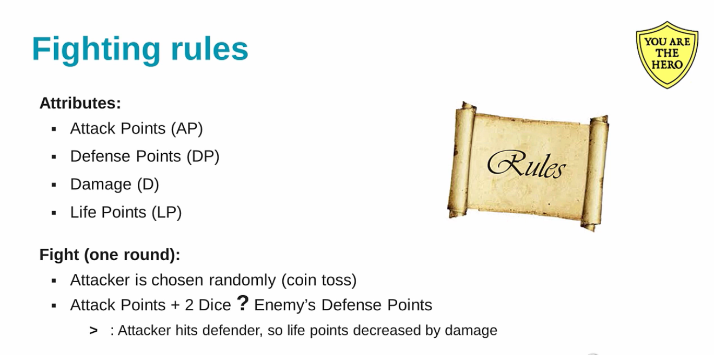

# FightingGame
Performing actions to simulate a Fighting Game. 

Sample Input :

Attack Points of Monster : 5  
Defence Points of Monster : 10  
Damage of Monster : 3  
Life Points of Monster : 40  
Your Attack Points : 10  
Your Defence Points : 5  
Your Damage : 6  
Your Life Points : 40  

Output of Single Game Round :

Your attack  
Rolled Value : 6  
Your attack value : 16  
Your attack was successful.   
Monster's remaining Life : 34  

Explanation : By random function we have calculated turn , which comes out to be our. 
Then We have got sum of Two dice value as 6 that is also calculated using random numbers .
Now attack value comes out to be 16 i.e. 10(attack points) + 6(rolled value)
since monster defence points are less than our attack value , our attack is successful and monster life decreases by 6 since we can decrease monster life by damage of 6 points.
